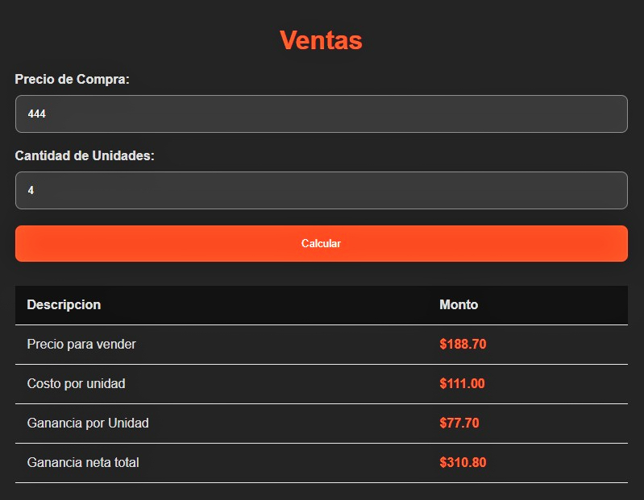

# Calculadora Empresarial

Una herramienta indispensable para facilitar al ponerle precios a nuevos productos en cantidades grandes con un margen de ganancia personalizable para el negocio o empresa.

¿Cómo funciona?
======
Solo basta con agregar el **Precio de compra** o **Costo que se paga por la mercancia a vender**, seguidamente de las **Cantidades** del producto:

Para personalizar el porcentaje de ganancia solo basta con ir a la siguiente linea de codigo y agregar la ganancia requerida:

Creador
======
Basvar, inc

basvar.com

contacto@basvar.com